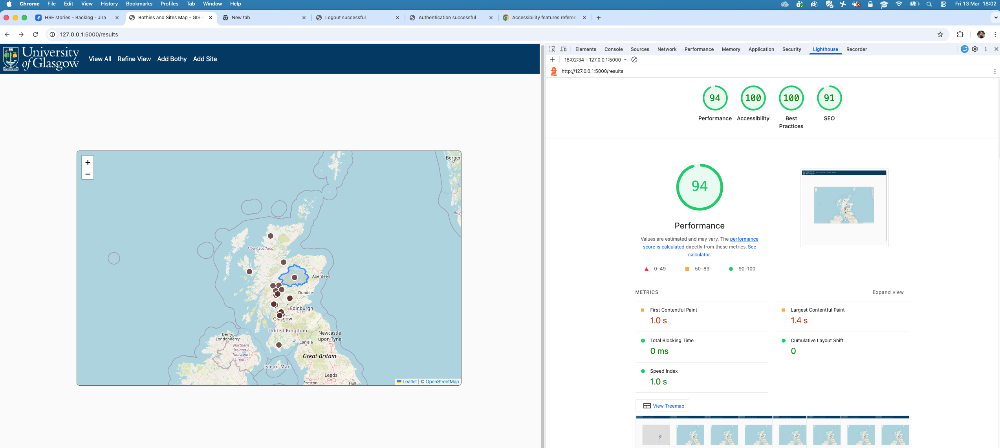
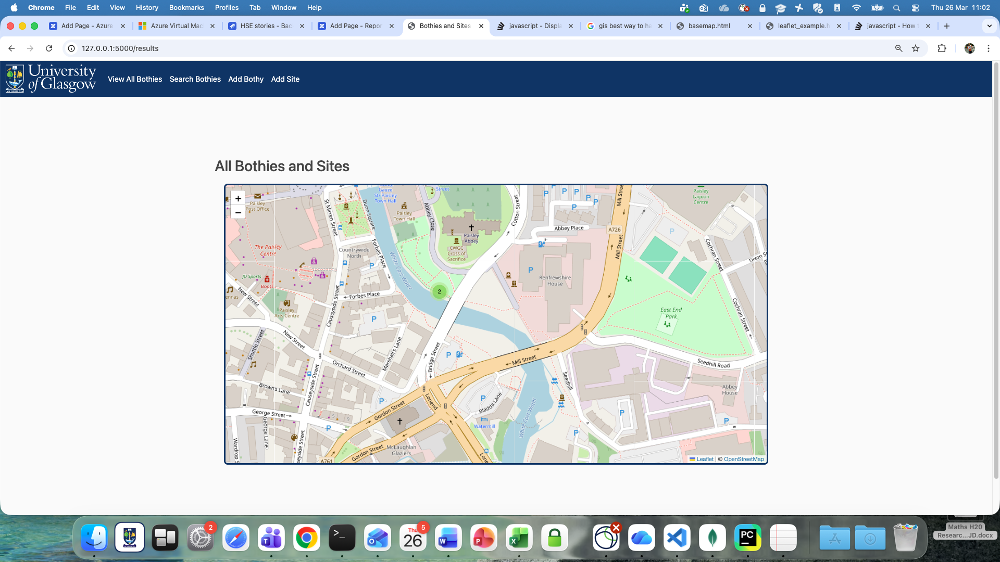
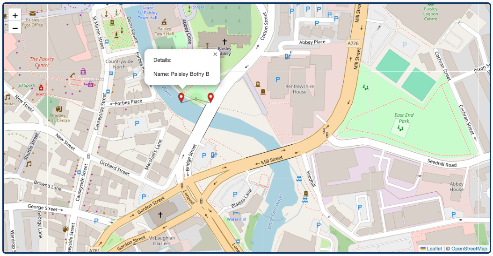

## MkDocs
```
mkdocs gh-deploy
```

## Formatting HTML

To format an html page open it, place the cursor at the template start and execute 'option shift F'. 
This will:

1. ensure no lines are too long,
2. ensure HTML is properly indented,
3. insert a blank line between the open html and open head tag, the close head and open body tag 
and the close body and the close html tag.

## Checking contrast

[Contrast Checker](https://webaim.org/resources/contrastchecker/)

To determine the colours on a page that are not defined in the template file, use the Chrome Color Picker extension.

## Achieving WCAG level AA accesibility for maps

Maps present a challenge to meeting WCAG level AA criteria, particularly around contrast between regions of background maps. ESRI provide a specialized, worldwide basemap designed with high contrast and colour-vision-deficient-safe colours. This guide does not cover utilisation of that base map but consideration of the use of that map is encouraged, along with thinking about how else the data portreyed on a map can be alternatively presented, e.g., as tabular data. In developing this guide the following items were implemented to improve on accessibility: 

1. Inclusion of a dark border around the map to improve the contrast ratio of a map.
2. Use of image-based point markers (rather than SVG) that facilitate inclusion of an alt tag.
3. Addition of an alt tag for all point markers.
4. Creation of a custom red point marker (rather the default pale blue marker) that meets the 3:1 contrast ratio requirement.
5. Styling the polygon presentation (rather the default blue perimeter) that meets the 3:1 contrast ratio requirement.

## Achieving WCAG level AA accesibility checklist

1. HTML tag has lang="en' attribute.
2. Language changes are marked with qualified span tag. (Not applicable to this application.)
3. Template pages use semantically rich structures: head, body header, nav and main that do NOT include redundent role attributes.
4. Links to new pages are implemented with `<a>` tags.
5. Link images have an alt attribute specifying the link target and the `<a>` tag does NOT also have an aria-label attribute (which would be redundent). N.B. the Chrome lighthouse report will suggest that you need aria-label
but we think that is incorrect.
6. Link text is adequately descriptive.
7. The singular list within the `<nav>` section does not have redundent role information within the `<ul>` and `<li>` tags.
8. Individual pages that inherit the base.html page have individual `<title>` element values.
9. The `<head>` section has the required `<meta name="viewport" content="width=device-width, initial-scale=1.0">` specification that does not disable zooming, and also has the recommended `<meta charset="UTF-8">` specification.
10. Form fields have `<label>` tags.
11. Related form content is wrapped in a `<fieldset>` tag with a `<legend>` tag.
12. Form fields and/or groups have sufficent descriptive text nearby.
13. Colour is not the only visual means of conveying information, indicating an action, prompting a response, or distinguishing a visual element, and the visual presentation of text and images of text has a contrast ratio of at least 4.5:1 (header section blue and white contrast is 11.97:1). 
14. The map has sufficient contrast to the background if no border is present or to the border if a border is present.
15. All layers added to the map have sufficient 3:1 constrast ratio with the background map.
16. Markers on the map have an alt tag and can be tabbed through.
17. Templates use heading levels without gaps: `<h2>` only or `<h2>` followed by `<h3>`.

## Test Accessibility

1. Tab through the site (i.e., without using the mouse) to check the order is natural and all items can be accessed.
2. Use a screen reader to access the site.
3. In Chrome, select View / Developer / Developer Tools. In the right hand pane select the Lighthouse tab, 
select the default navigation, Desktop, and all four categeories and click the Analyse page load button.



## Handle multiple overlapping points

Although in the bothy scenario it is unlikely that two bothies can co-exist in the same location, quite often you do have to deal with
multiple points at the same location such as a recording site with multiple sensors each recording a datastream, or multiple samples that
are collected at the same location. Leaflet will not handle this by default but with the Leaflet markercluster plugin this can be handled.
The following imports need to be in the `<head>` section

```
    <link rel="stylesheet" href="https://unpkg.com/leaflet.markercluster@1.3.0/dist/MarkerCluster.css" />
    <link rel="stylesheet" href="https://unpkg.com/leaflet.markercluster@1.3.0/dist/MarkerCluster.Default.css" />
    <script src="https://unpkg.com/leaflet.markercluster@1.3.0/dist/leaflet.markercluster.js"></script>
```

You also need to declare a marker cluster variable and add each marker to it:

```
		var markers = L.markerClusterGroup();
		const bothyLayer = L.geoJSON(geojson, {
			onEachFeature,
			pointToLayer(feature, latlng) {
				return L.marker(latlng, {
					icon: customIcon,
					alt: feature.properties.name
				});
			}
		}).addTo(markers);
		markers.addTo(map);
```



